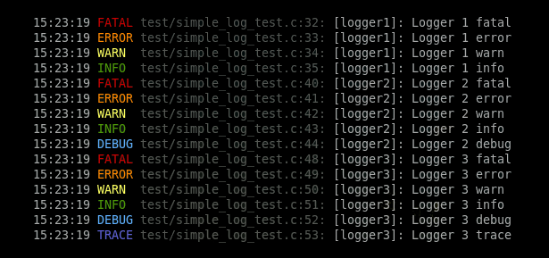

# simple_log
A simple logging library based on rxi log.c (https://github.com/rxi/log.c)
This library was enhanced with basic loggers and environment variable parsing
to initialize the library.




## Usage
**[simple_log.c](src/simple_log.c?raw=1)** and **[simple_log.h](include/simple_log.h?raw=1)** should be included into an existing project and compiled along with it.
In order to use it, one can look at the example provided **[simple_log_test.c](test/simple_log_test.c?raw=1)**.

Before using it, the library must be initialized. First call is to initialize the loggers using `simple_log_set_loggers`:

```c 
enum my_logger {       
	LOGGER_1,
	LOGGER_2,
	LOGGER_COUNT,
};

static const char *logger_names[LOGGER_COUNT] =
{
	[LOGGER_1] = "logger1",
	[LOGGER_2] = "logger2",
};

int main()
{
	...
	simple_log_set_loggers(logger_names, LOGGER_COUNT);
	...
}
```

This will define the loggers count and names.
Then, `simple_log_init` should be called to initialize logging according to an environnement variable value.
```c
simple_log_init("MY_LOG");
```

`MY_LOG` should contain the levels of logging according to the following specification :
- `help`: display the available loggers names
- `<number>:[<logger1_name>.<logger1_level>:]`. Using this notation allows to set the global level first (`<number>`) and then loggers level independently.

Levels are numbered according to the following:
 - 0: Fatal
 - 1: Error
 - 2: Warning
 - 3: Informations
 - 4: Debug
 - 5: Trace

For instance to set global level to TRACE and logger2 level to FATAL, the following string should be used:
```
MY_LOG=5:logger2.0
```

For logging, the library provides 6 function-like macros:

```c
simple_log_trace(int logger, const char *fmt, ...);
simple_log_debug(int logger, const char *fmt, ...);
simple_log_info(int logger, const char *fmt, ...);
simple_log_warn(int logger, const char *fmt, ...);
simple_log_error(int logger, const char *fmt, ...);
simple_log_fatal(int logger, const char *fmt, ...);
```

Each function takes a printf format string followed by additional arguments:

```c
simple_log_trace(logger, "Hello %s", "world")
```

Resulting in a line with the given format printed to stderr:

```
20:18:26 TRACE src/main.c:11: [logger] Hello world
```

#### SIMPLE_LOG_USE_COLOR
If the library is compiled with `-DSIMPLE_LOG_USE_COLOR` ANSI color escape codes will
be used when printing.

## License
This library is free software; you can redistribute it and/or modify it under
the terms of the MIT license. See [LICENSE](LICENSE) for details.
